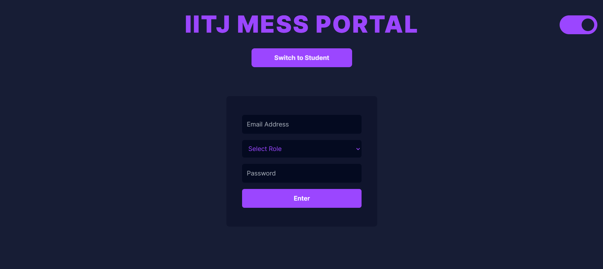

# IITJ Mess Portal - Pay As You Eat 🍴

## **Overview**
The IITJ Mess Portal addresses the challenges students face with the current fixed mess billing system. This project introduces a pay-as-you-eat system that tracks students' meals and generates bills based on actual consumption. 

Students, mess vendors, and admins are provided with specific functionalities to streamline the process. The portal enhances convenience and accountability while reducing operational burdens for Hostel Affairs.


---

**Mentor:** Dr. Arpit Khandelwal  

---

## **Tech Stack**
- **Frontend:** React.js  
- **Backend:** Node.js  
- **Database:** MongoDB  
- **Cloud Storage:** AWS S3  


---

<!-- ## **Useful Links**
- **Frontend Repository:** [GitHub](#)  
- **Backend Repository:** [GitHub](#)  
- **Deployed Backend (Render):** [API](#)  
- **API Documentation (Swagger):** [Documentation](#)  
- **Deployed Frontend (Vercel):** [URI](#)  

--- -->

## **Why this Mess Portal?**

Students at IITJ often pay a fixed monthly mess bill, irrespective of actual meals consumed. This leads to financial inefficiencies and dissatisfaction due to skipped meals or dissatisfaction with food quality. The **Pay-As-You-Eat Mess Portal** solves this by:  
1. **Tracking individual meals** to generate consumption-based bills.  
2. Reducing operational burdens on the Office of Student Affairs.  
3. Offering seamless registration and tracking for students and mess vendors.  

---

## **Features**
### **1. Student Role**
- **Registration & QR Code Generation:** Students register with their IITJ email, receive a unique QR code for attendance, and select their preferred mess (Old/New).  
- **Meal Tracking:** Students can view their meal history and current selections.  
- **Secure QR Regeneration:** Students can regenerate their QR codes (limited to once per week).  

### **2. Mess Vendor Role**
- **Attendance Marking:** Vendors mark attendance using QR code scanning or biometric authentication.  
- **Data Insights:** Vendors can view the number of students attending meals (today, tomorrow, or past days) to plan food preparation.  

### **3. Admin Role**
- **Biometric Registration:** Admins conduct fingerprint registration sessions for students.  
- **Attendance Management:** Admins manage attendance records by date or student roll number.  
- **Data View:** Admins can view overall attendance data to track trends and ensure accuracy.  

---

## **System Architecture**
The project follows the **Model-View-Controller (MVC)** architecture for efficient and scalable development.  

### **Backend**
- Built with Node.js and organized into separate controllers for users and mess operations.  
- **Security Features:**
  - Passwords are hashed with `bcrypt`.  
  - Sensitive data is encrypted with AES-256 and stored securely in `.env` files.  
  - QR codes are hashed using SHA-256 with roll numbers and timestamps for added security.  
- **API Versioning:** Ensures backward compatibility as the system evolves.  
- **Storage:** Fingerprint and QR code images are securely stored in AWS S3.  

### **Frontend**
- Built with React.js for an intuitive and responsive interface.  
- **Features for Each Role:**
  - Students: Register, manage meals, and track attendance.  
  - Mess Vendors: Streamlined attendance marking and food planning.  
  - Admins: Biometric management and attendance data tracking.  

### **Database**
- **Database:** MongoDB  
- **Key Models:**
  - **User Model:** Tracks student details, including fingerprint and hashed QR content.  
  - **Mess Model:** Tracks mess registrations and attendance records.  
- **Relationships:**
  - One-to-One: A student can only register for one mess at a time.  

---

## **Security Measures**
- Passwords are hashed using `bcrypt`.  
- Sensitive data is encrypted with **AES-256**.  
- QR codes use **SHA-256 hashing** for secure meal tracking.  
- Fingerprint data is encrypted before storage.  

---

## **Setup Instructions**
### **Backend**
1. Clone the repository:  
   ```bash
   git clone https://github.com/charansingh25/iitj-mess-portal.git
   cd backend
   ```

2. Install dependencies:
   ```bash
   npm install
   ```

3. Create a `.env` file with the following keys:
    ```bash
    PORT=8080
    MONGODB_USERNAME=<your-monogodb-username>
    MONGODB_PASS=<your-mongodb-password>
    DATABASE_NAME=<database-name>
    HTTP_PORT=80
    NODE_ENV=development
    EXPRESS_SESSION_SECRET=<secret-key>
    AWS_ACCESS_KEY_ID=<your-aws-access-key-id>
    AWS_SECRET_ACCESS_KEY=<your-aws-secret-access-key>
    AWS_REGION=ap-south-1
    AWS_S3_BUCKET_NAME=<s3-bucket-name>

    # Email Configuration
    EMAIL_HOST=smtp.gmail.com
    EMAIL_PORT=587
    EMAIL_SECURE=false
    EMAIL_USER=<your-email-address (senders email)>
    EMAIL_PASS=<email-app-password>
    EMAIL_FROM=<email-from>

    # QR Code Secret Key
    QR_SECRET_KEY=<secret-key-for-creating-hash-for-QR-code>
    ENCRYPTION_KEY=<encryption-key-for-encrypting-information>
    ENCRYPTION_ALGORITHM=aes-256-cbc
    ACCESS_TOKEN_SECRET=<access-token-secret>
    SECRET_EXPIR_TIME=<access-token-expiry-time || 1d>
    ```

4. Start the server:
    ```bash
    npm start
    ```

### **Frontend**
1. Clone the repository:  
   ```bash
   git clone https://github.com/charansingh25/iitj-mess-portal.git
   cd frontend
   ```

2. Install dependencies:
   ```bash
   npm install
   ```

3. Create a `.env` file with the following keys:
    ```bash
    VITE_ENCRYPTION_KEY=<encryption-key-for-encrypting-information>
    VITE_ENCRYPTION_ALGORITHM=aes-256-cbc
    VITE_BACKEND_URL=http://localhost/api/v1
    ```

4. Start the server:
    ```bash
    npm start
    ```
---
## **ScreenShots**

### Landing Pages



## Student Dashboard


## Admin Dashboard


## Mess Dashboard


